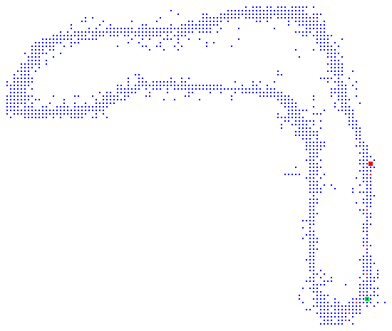

# liftoff-map builder

Read data.csv in current folder and generate path.png based on coordinates there.

- START - big green dot, first 10 dots are also green
- FINISH - big red dot, last 10 dots are also red

Example for Minus Two level:

